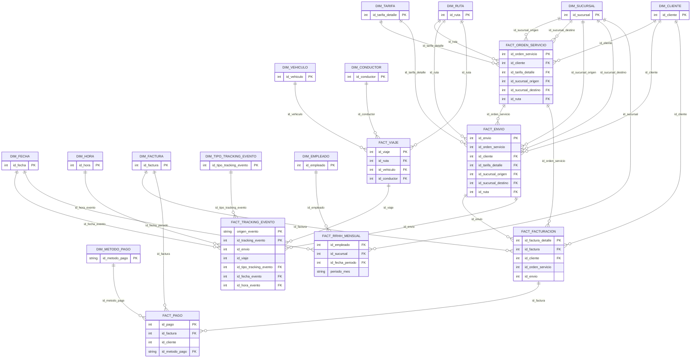

# MODELO DWH DBT - REFERENCIA PARA GRAFICO

## 1) Resumen

- Modelo: estrella (star schema)
- Dimensiones: 12
- Hechos: 7
- Base de referencia: `dbt_dwh_transportes/models/marts/*`

## 2) Dimensiones

### `dim_fecha` (PK: `id_fecha`)

Atributos:
- `id_fecha`
- `fecha`
- `anio`
- `trimestre`
- `mes`
- `nombre_mes`
- `semana_iso`
- `dia_mes`
- `dia_semana`
- `fin_semana_flag`

### `dim_hora` (PK: `id_hora`)

Atributos:
- `id_hora`
- `hora`
- `minuto`
- `franja_horaria`

### `dim_cliente` (PK: `id_cliente`)

Atributos:
- `id_cliente`
- `id_entidad`
- `nombre_razon_social`
- `numero_documento`
- `segmento`
- `ciudad`
- `estado_cliente`
- `fecha_alta`

### `dim_tarifa` (PK: `id_tarifa_detalle`)

Atributos:
- `id_tarifa_detalle`
- `id_tarifario`
- `tipo_tarifario`
- `tipo_carga`
- `origen_ciudad`
- `destino_ciudad`
- `peso_desde_kg`
- `peso_hasta_kg`
- `precio_unitario_bob`
- `vigente_desde`
- `vigente_hasta`

### `dim_sucursal` (PK: `id_sucursal`)

Atributos:
- `id_sucursal`
- `codigo_sucursal`
- `ciudad`
- `activa_flag`

### `dim_ruta` (PK: `id_ruta`)

Atributos:
- `id_ruta`
- `codigo_ruta`
- `id_sucursal_origen`
- `id_sucursal_destino`
- `ciudad_origen`
- `ciudad_destino`
- `distancia_km`

### `dim_vehiculo` (PK: `id_vehiculo`)

Atributos:
- `id_vehiculo`
- `placa`
- `tipo_servicio`
- `capacidad_kg`
- `estado_vehiculo`
- `id_sucursal_base`

### `dim_conductor` (PK: `id_conductor`)

Atributos:
- `id_conductor`
- `id_empleado_rrhh`
- `licencia_nro`
- `id_sucursal_base`
- `estado_conductor`

### `dim_factura` (PK: `id_factura`)

Atributos:
- `id_factura`
- `nro_factura`
- `id_cliente`
- `fecha_emision`
- `fecha_vencimiento`
- `subtotal_bob`
- `impuesto_bob`
- `total_bob`
- `estado_cobro`

### `dim_metodo_pago` (PK: `id_metodo_pago`)

Atributos:
- `id_metodo_pago`
- `metodo_pago`

### `dim_tipo_tracking_evento` (PK: `id_tipo_tracking_evento`)

Atributos:
- `id_tipo_tracking_evento`
- `origen_evento`
- `tipo_tracking_evento`
- `categoria_tracking`
- `nivel_alerta`

### `dim_empleado` (PK: `id_empleado`)

Atributos:
- `id_empleado`
- `ci`
- `nombre_completo`
- `cargo`
- `area`
- `id_sucursal`
- `fecha_ingreso`
- `estado_laboral`

## 3) Hechos

### `fact_orden_servicio` (grano: 1 fila por `id_orden_servicio`)

IDs / claves:
- `id_orden_servicio`
- `id_reserva_credito`
- `id_cuenta_credito`
- `id_cliente`
- `id_contrato`
- `id_tarifa_detalle`
- `id_sucursal_origen`
- `id_sucursal_destino`
- `id_ruta`
- `id_fecha_creacion_orden`
- `id_fecha_vigencia_orden`
- `id_fecha_primer_envio`
- `id_fecha_ultimo_envio`
- `id_fecha_primer_compromiso_recojo`
- `id_fecha_ultimo_compromiso_recojo`
- `id_fecha_ultimo_cierre_envio`

Metricas / flags:
- `cantidad_ordenes`
- `cantidad_envios`
- `precio_manual_flag`
- `orden_aprobada_flag`
- `envio_generado_flag`
- `envio_cerrado_flag`
- `orden_vencida_sin_envio_flag`
- `devuelto_flag`
- `facturado_flag`
- `total_orden_bob`
- `monto_reservado_bob`
- `limite_credito_bob_snapshot`
- `saldo_utilizado_bob_snapshot`
- `saldo_vencido_bob_snapshot`
- `credito_disponible_bob_snapshot`
- `monto_facturado_bob`
- `cantidad_lineas_facturadas`

### `fact_envio` (grano: 1 fila por `id_envio`)

IDs / claves:
- `id_envio`
- `id_orden_servicio`
- `id_reserva_credito`
- `id_cuenta_credito`
- `id_cliente`
- `id_contrato`
- `id_tarifa_detalle`
- `id_sucursal_origen`
- `id_sucursal_destino`
- `id_ruta`
- `id_fecha_creacion_orden`
- `id_fecha_vigencia_orden`
- `id_fecha_registro_envio`
- `id_fecha_compromiso_recojo`
- `id_fecha_cierre_envio`

Metricas / flags:
- `cantidad_envios`
- `orden_aprobada_flag`
- `envio_generado_flag`
- `envio_cerrado_flag`
- `cumple_sla_recojo_flag`
- `devuelto_flag`
- `facturado_flag`
- `peso_envio_kg`
- `volumen_envio_m3`
- `valor_declarado_bob`
- `horas_orden_a_envio`
- `tiempo_ciclo_horas`
- `desviacion_sla_horas`
- `monto_facturado_bob`
- `cantidad_lineas_facturadas`

### `fact_viaje` (grano: 1 fila por `id_viaje`)

IDs / claves:
- `id_viaje`
- `id_ruta`
- `id_vehiculo`
- `id_conductor`
- `id_sucursal_origen`
- `id_sucursal_destino`
- `id_fecha_salida`
- `id_fecha_llegada`

Metricas / flags:
- `cantidad_viajes`
- `distancia_km`
- `capacidad_kg`
- `peso_total_asignado_kg`
- `ocupacion_pct`
- `cantidad_envios_asignados`
- `costo_operativo_total_bob`
- `costo_operativo_km_bob`
- `viaje_finalizado_flag`
- `sobrecapacidad_flag`
- `mantenimiento_correctivo_flag_30d`
- `cobertura_telemetria_pct`
- `interrupciones_senal_count`
- `alertas_totales_count`
- `alertas_criticas_count`
- `alertas_mecanicas_count`
- `temp_max_motor_c`
- `velocidad_promedio_kmh`
- `costo_mantenimiento_30d_bob`

### `fact_tracking_evento` (grano: 1 fila por `origen_evento` + `id_tracking_evento`)

IDs / claves:
- `origen_evento`
- `id_tracking_evento`
- `id_envio`
- `id_viaje`
- `id_ruta`
- `id_sucursal`
- `id_vehiculo`
- `id_conductor`
- `id_tipo_tracking_evento`
- `id_fecha_evento`
- `id_hora_evento`

Metricas / flags:
- `cantidad_eventos`
- `evento_critico_flag`
- `alerta_critica_flag`
- `gap_desde_evento_prev_min`
- `temperatura_motor_c`
- `velocidad_kmh`
- `mantenimiento_correctivo_30d_flag`

### `fact_facturacion` (grano: 1 fila por `id_factura_detalle`)

IDs / claves:
- `id_factura_detalle`
- `id_factura`
- `id_cliente`
- `id_orden_servicio`
- `id_envio`
- `id_ruta`
- `id_fecha_emision`
- `id_fecha_vencimiento`

Metricas:
- `cantidad_lineas`
- `cantidad`
- `precio_unitario_bob`
- `total_linea_bob`

### `fact_pago` (grano: 1 fila por `id_pago`)

IDs / claves:
- `id_pago`
- `id_factura`
- `id_cliente`
- `id_metodo_pago`
- `id_fecha_pago`

Metricas / flags:
- `cantidad_pagos`
- `pago_tardio_flag`
- `monto_bob`
- `dias_cobro_desde_emision`
- `dias_mora_pago`

### `fact_rrhh_mensual` (grano: 1 fila por `id_empleado` + `periodo_mes`)

IDs / claves:
- `id_empleado`
- `id_sucursal`
- `periodo_mes`
- `id_fecha_periodo`

Metricas:
- `cantidad_empleados`
- `salario_base_bob`
- `liquido_pagable_bob`
- `horas_trabajadas`
- `horas_extra`
- `dias_ausencia`
- `tasa_ausentismo_pct`
- `fte_equivalente`

## 4) Relaciones (FK de hechos -> PK de dimensiones)

Nota:
- Esta seccion lista solo las FK declaradas/validadas en `marts.yml`.
- En la seccion de hechos, "IDs / claves" incluye tambien claves analiticas no declaradas como FK.

- `fact_orden_servicio.id_cliente` -> `dim_cliente.id_cliente`
- `fact_orden_servicio.id_tarifa_detalle` -> `dim_tarifa.id_tarifa_detalle`
- `fact_orden_servicio.id_sucursal_origen` -> `dim_sucursal.id_sucursal`
- `fact_orden_servicio.id_sucursal_destino` -> `dim_sucursal.id_sucursal`
- `fact_orden_servicio.id_ruta` -> `dim_ruta.id_ruta`

- `fact_envio.id_cliente` -> `dim_cliente.id_cliente`
- `fact_envio.id_tarifa_detalle` -> `dim_tarifa.id_tarifa_detalle`
- `fact_envio.id_sucursal_origen` -> `dim_sucursal.id_sucursal`
- `fact_envio.id_sucursal_destino` -> `dim_sucursal.id_sucursal`
- `fact_envio.id_ruta` -> `dim_ruta.id_ruta`

- `fact_viaje.id_ruta` -> `dim_ruta.id_ruta`
- `fact_viaje.id_vehiculo` -> `dim_vehiculo.id_vehiculo`
- `fact_viaje.id_conductor` -> `dim_conductor.id_conductor`

- `fact_tracking_evento.id_tipo_tracking_evento` -> `dim_tipo_tracking_evento.id_tipo_tracking_evento`
- `fact_tracking_evento.id_fecha_evento` -> `dim_fecha.id_fecha`
- `fact_tracking_evento.id_hora_evento` -> `dim_hora.id_hora`

- `fact_facturacion.id_factura` -> `dim_factura.id_factura`
- `fact_facturacion.id_cliente` -> `dim_cliente.id_cliente`

- `fact_pago.id_factura` -> `dim_factura.id_factura`
- `fact_pago.id_metodo_pago` -> `dim_metodo_pago.id_metodo_pago`

- `fact_rrhh_mensual.id_empleado` -> `dim_empleado.id_empleado`
- `fact_rrhh_mensual.id_sucursal` -> `dim_sucursal.id_sucursal`
- `fact_rrhh_mensual.id_fecha_periodo` -> `dim_fecha.id_fecha`

## 5) Relaciones de referencia entre hechos (analiticas, no FK declaradas en `marts.yml`)

- `fact_envio.id_orden_servicio` <-> `fact_orden_servicio.id_orden_servicio`
- `fact_facturacion.id_orden_servicio` <-> `fact_orden_servicio.id_orden_servicio`
- `fact_facturacion.id_envio` <-> `fact_envio.id_envio`
- `fact_pago.id_factura` <-> `fact_facturacion.id_factura`
- `fact_tracking_evento.id_envio` <-> `fact_envio.id_envio`
- `fact_tracking_evento.id_viaje` <-> `fact_viaje.id_viaje`

## 6) Diagrama Mermaid (base para grafico)

